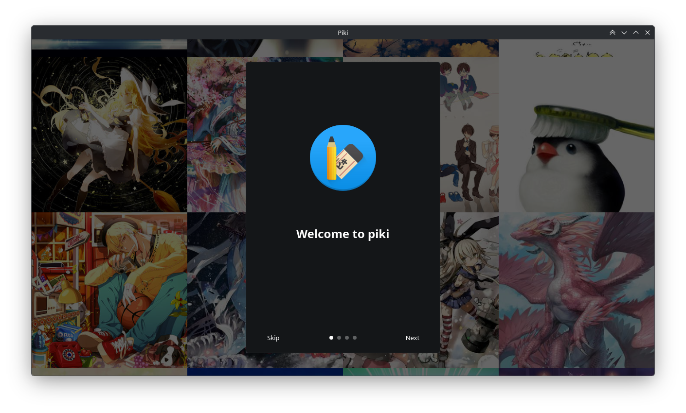
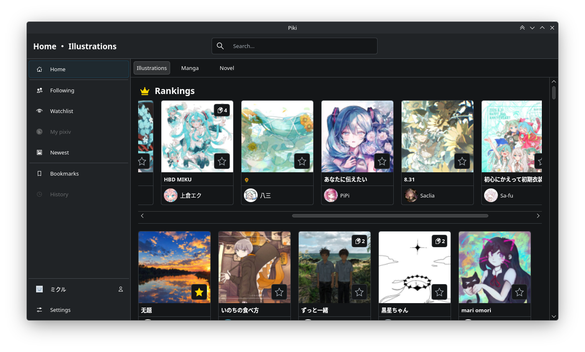
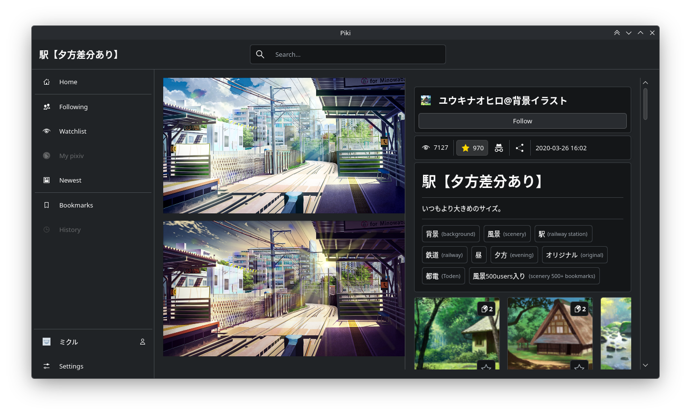
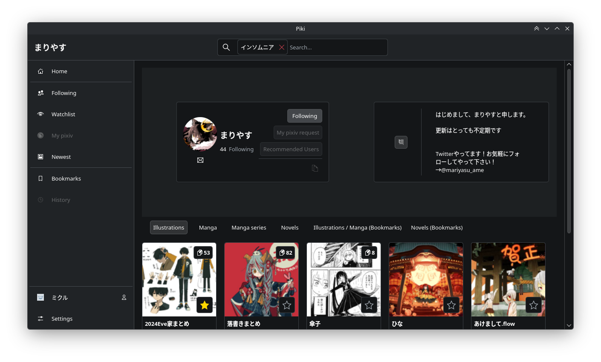
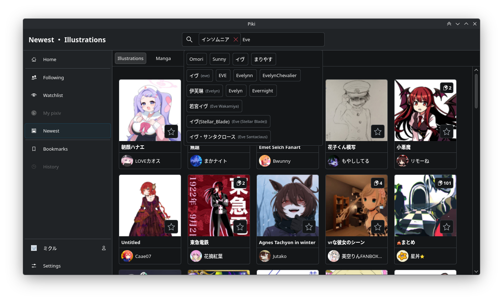

<br/>

# Piki

Unofficial Kirigami client for Pixiv.

## Features

- Multi-account support (tags for search queries are cached per-account)
- Setting works as wallpapers (works on KDE and Hyprland only)
- Opening illustration/manga directly by submitting URL in search bar
- Configuration of startup page

(+ basic browsing, follows, bookmarks)

## Screenshots







## Project structure
**Piki** = front-end Kirigami app\
**[Piqi](https://github.com/MicrogamerCz/Piqi)** = unofficial Qt-based Pixiv API

---

## Installation

```sh
# Flatpak
flatpak install io.github.microgamercz.piki

# ---------------

# Arch (via AUR)
yay -S piki-git

# ---------------

# OpenSUSE (unofficial via OBS)
# Tumbleweed repo
zypper addrepo https://download.opensuse.org/repositories/home:/Nara/openSUSE_Tumbleweed/home:Nara.repo
# Slowroll repo
zypper addrepo https://download.opensuse.org/repositories/home:/Nara/openSUSE_Slowroll/home:Nara.repo

zypper refresh
zypper install piki
```

---

## Contributions

Code/translation contributions are welcome, as well as independent testing.

### Translations

- Czech
- Dutch (by [Vistaus](https://github.com/Vistaus))

---

## Used libraries and assets
- **Qt + Kirigami (and other KDE Frameworks) + Kirigami Addons**
- **L4ki** - icons from *Vivid Glassy Dark* icon pack (favorites-symbolic, folder-paint-symbolic)
- **ZipFile** - [Pixiv auth process](https://gist.github.com/ZipFile/c9ebedb224406f4f11845ab700124362)
- [**Crown icon for Rankings**](https://www.svgrepo.com/svg/120683/royal-crown)
- **Audiotube** - design style of sidebar and header
- **QCoro**
- **QtKeyring**

**If you like Pixiv, consider paying for Pixiv premium.**

---

# (A lot of) TODOs
- Fixes
  - Typos in original strings or Czech translations
  - Novels feeds not loading
- General
  - [x] Improve performance (especially after navigating a few feed pages)
  - [x] Notifications *(will be implemented in Piqi after rewriting the API)*
  - [ ] Rewrite SelectionButtons to work based on index (or use different control)
  - [ ] Create templates for certain SelectionButtons implementations, they aren't much different from each other
  - [ ] Account settings
  - [ ] Cropping for "Set as wallpaper" share option when there's a mismatch between the aspect ratio of the image and the monitor
  - [ ] Use more integrated controls (such as StatefulWindow instead of ApplicationWindow)
  - [ ] Messages as on web client
  - [ ] Posting new illusts/manga/novels (button will be in the top right corner)
  - [ ] Local browsing history (+ online for premium users)
  - [ ] Convergent layout
  - [ ] my Pixiv page
  - [ ] Proper Android support
  - [ ] pixiv Premium features
  - [ ] Fix object caching
  - [ ] Rewrite login process to remove dependency on QtWebEngine
  - [ ] Implementing pixiv Fanbox (least important)
- Profile page
  - [ ] More appropriate icon for fanbox link
  - [ ] Add buttons for other social media (twitter, pawoo, etc. like on web client)
- Novel page
  - [ ] Custom viewer parsed from the DOM
- Welcome
  - [ ] Setup showing user the interface
  - [ ] Showing privacy policy popup (same as in the official app)(?)
  - [ ] Fix animations of Welcome screen, polish the design
- Comments
  - [ ] Adding comments (as well as replies)
  - [ ] Deleting Comments
  - [ ] Parsing pixiv emojies (eg. `(emote)`) into Unicode or freedesktop icon emojis
  - [ ] Change the way comments (and replies) collapse
- Settings
  - [ ] Add individual account settings
  - [ ] Add semi-variable limit for number of tags fetched from history
- IllustView page
  - [ ] Add mute button
  - [ ] Add report button
  - [ ] Make other artist's illusts center on the current work
  - [ ] Fetching more arts from the artist (like on web client)
  - [ ] Show a notification dialog when setting wallpaper on unsupported desktop without portal
- Notifications
  - [ ] Add notifications history length configuration
  - [ ] Add configuration whether to show already seen notifications
  - [ ] Add background daemon with desktop notifications
    - [ ] Add configuration to listen for notifications (opt-in)
    - [ ] Add a small first-time popup
    - Should run on startup or when Piki is launched
    - Has separate instance of Piqi client, independently gets refreshToken
    - [ ] Add semi-variable polling interval
    - [ ] Add systemd user service for notifications daemon
- IllustView page
  - [ ] Add mute button
  - [ ] Add report button
  - [ ] Make other artist's illusts center on the current work
  - [ ] Fetching more arts from the artist (like on web client)
  - [ ] Show a notification dialog when setting wallpaper on unsupported desktop without portal
