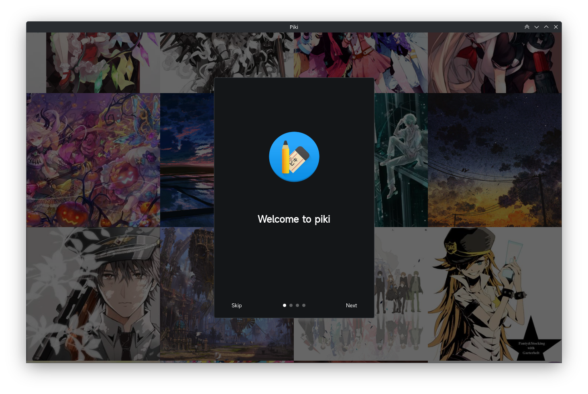
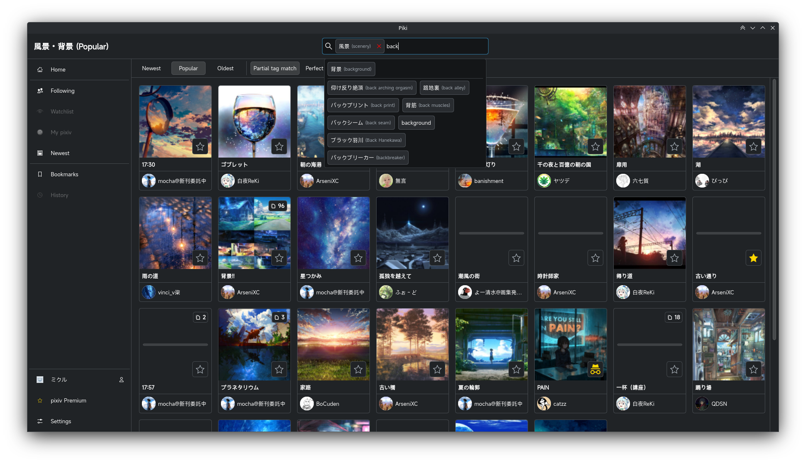

<br/>

# Piki

Unofficial Kirigami client for Pixiv.

## Screenshots






## Project structure
**Piki** = front-end Kirigami app\
**[Piqi](https://github.com/MicrogamerCz/Piqi)** = unofficial Qt-based Pixiv API

---

## Installation

```sh
# Flatpak
flatpak install io.github.microgamercz.piki

# Arch (via AUR)
yay -S piki-git
```

---

## Contributions

Code/translation contributions are welcome, as well as independent testing.

### Translations

- Czech
- Dutch (by [Vistaus](https://github.com/Vistaus))

---

## Used libraries and assets
- **Qt + Kirigami (and other KDE Frameworks) + Kirigami Addons**
- **L4ki** - icons from *Vivid Glassy Dark* icon pack (favorites-symbolic, folder-paint-symbolic)
- **ZipFile** - [Pixiv auth process](https://gist.github.com/ZipFile/c9ebedb224406f4f11845ab700124362)
- [**Crown icon for Rankings**](https://www.svgrepo.com/svg/120683/royal-crown)
- **Audiotube** - design style of sidebar and header
- **QCoro**
- **QtKeyring**

**If you like Pixiv, consider paying for Pixiv premium.**

---

# (A lot of) TODOs
- General
  - [ ] Improve performance (especially after navigating a few feed pages)
  - [ ] Network error handling - either with passive notifications or dialogs
  - [ ] Splitting Header and Search field
  - [ ] Convergent layout
  - [ ] pixiv Premium features
  - [ ] Fix object caching
  - [ ] Cancel downloads after navigating to a different page
  - [ ] Rewrite SelectionButtons to work based on index, without doing chess with the values
  - [ ] Create templates for certain SelectionButtons implementations, they aren't much different from each other
  - [ ] Bind tags history to each account in local cache
  - [ ] Use more integrated controls (such as StatefulWindow instead of ApplicationWindow)
  - [ ] Notifications(?)
  - [ ] Proper Android support
  - [ ] Messages from web client
  - [ ] Implementing pixiv Fanbox (least important)
  - [ ] Posting new illusts/manga/novels (button will be in the top right corner)
  - [ ] Account settings
  - [ ] my Pixiv page
  - [ ] Local browsing history (+ online for premium users)
  - [ ] Rewrite login process to remove dependency on QtWebEngine
  - [ ] Cropping for "Set as wallpaper" share option when there's a mismatch between the aspect ratio of the image and the monitor
- Profile page
  - [ ] More appropriate icon for fanbox link
- Novel page
  - [ ] Custom viewer parsed from the DOM
- Welcome
  - [ ] Setup showing user the interface
  - [ ] Showing privacy policy popup (same as in the official app)(?)
  - [ ] Fix animations of Welcome screen, polish the design
- Comments
  - [ ] Adding comments (even replies)
  - [ ] Deleting Comments
  - [ ] Parsing pixiv emojies into Unicode or freedesktop icon emojis
- Settings
  - [ ] Add individual account settings
